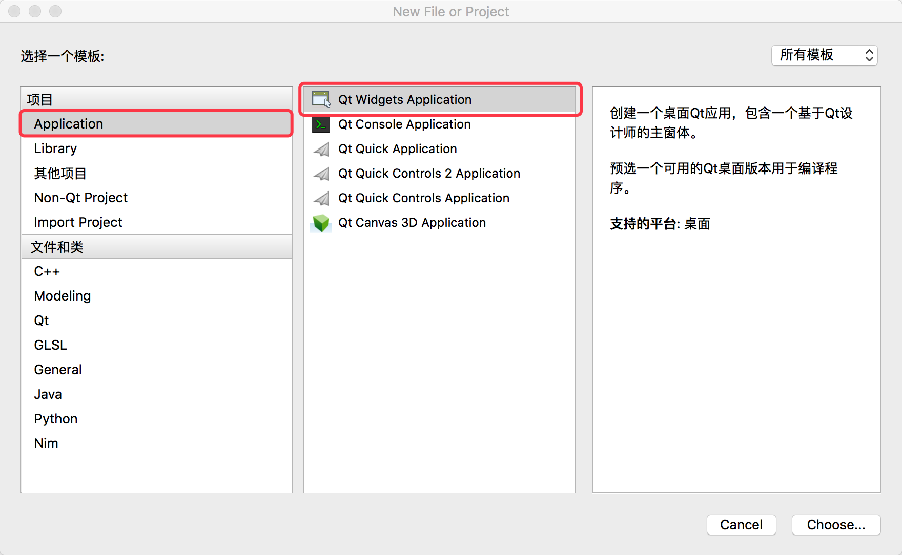
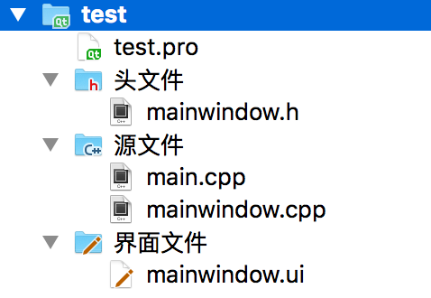
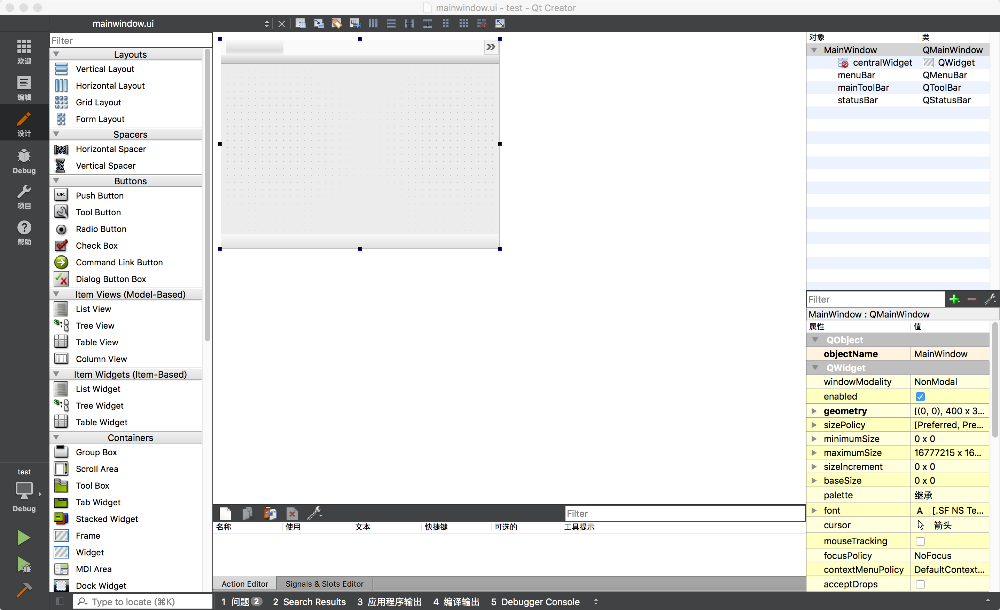
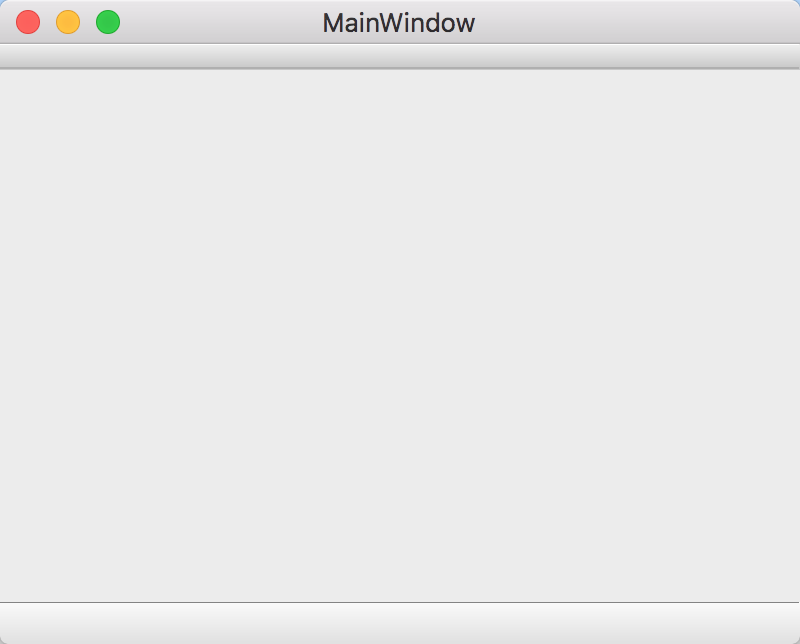
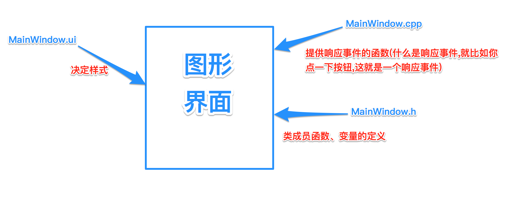
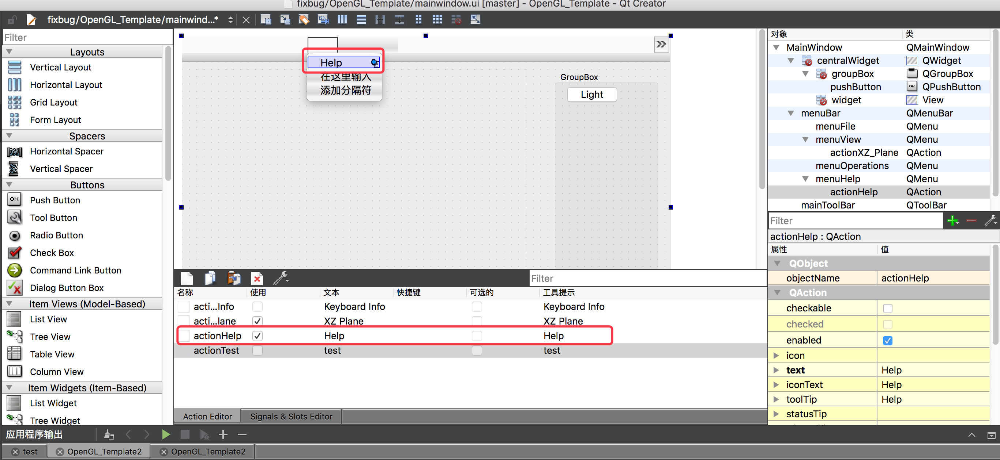
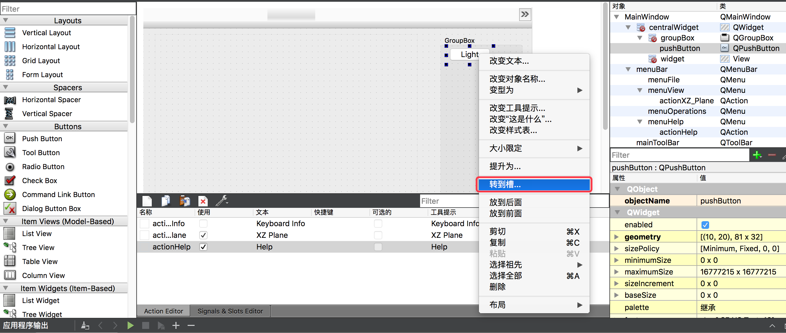
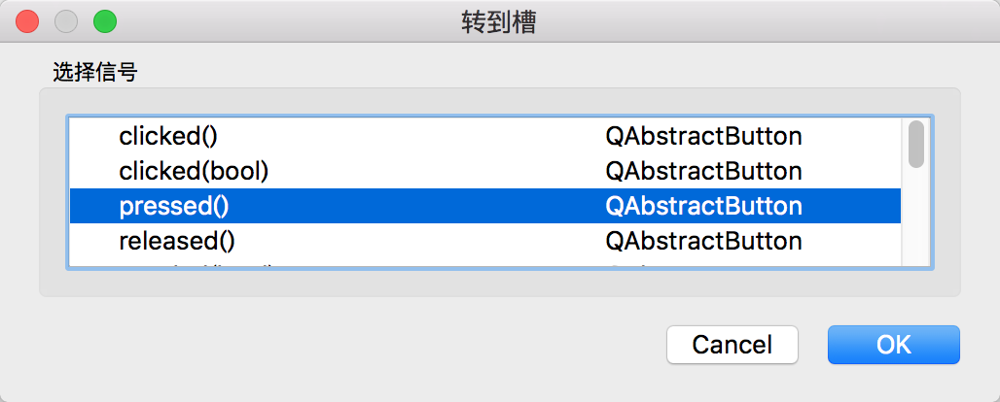
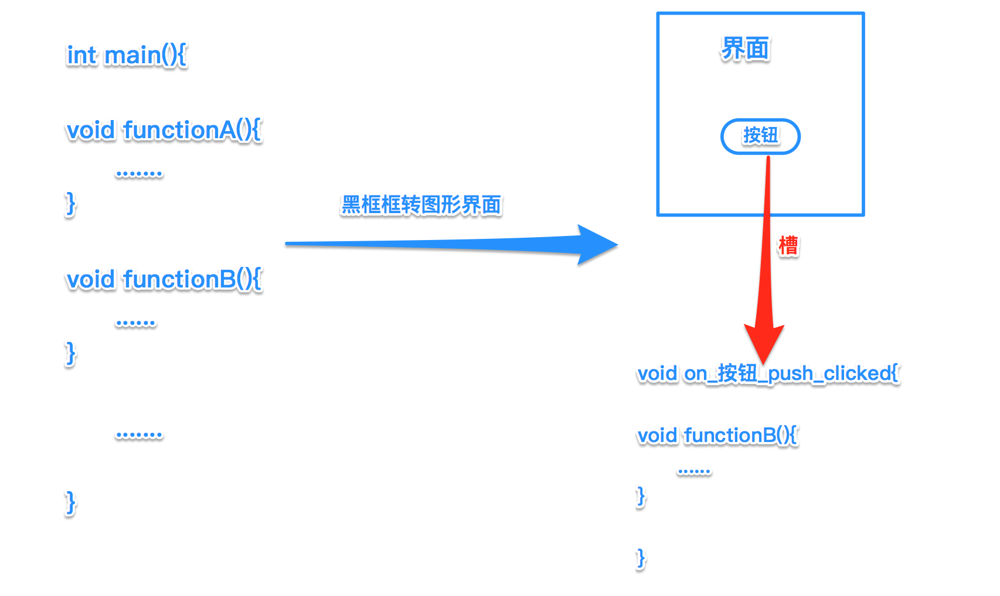

# 简单聊一聊图形界面
## 一般普通的黑框框程序   (Low)
```
......

int main()
{
	.......
	return 0;
}
```
特点:从 main 函数入口开始一行行自动运行,直到 return 0; 结束.
## 带一些 switch 选择的黑框框程序  (稍好一点但还是 Low)
```
......

int main()
{
	.......
    cin>>input;
    switch (input) {
    case valueA:
        functionA();
        break;
    case valueB:
        functionB();
        break;
    case valueC:
        functionC();
        break;
    .....
    default:
        break;
    }
	return 0;
}
```
特点:可以通过输入不同的数字或者字符,选择实现不同的功能.
## 图形界面 (好一些)
```
#include "mainwindow.h"
#include <QApplication>

int main(int argc, char *argv[])
{
    QApplication a(argc, argv);
    MainWindow w;
    w.show();

    return a.exec();
}
```
特点: 从main进入之后一般都是调用一个窗口显示,然后结束于窗口关闭.

下面我们说一说怎么使用 Qt 实现图形界面

首先,新建一个工程看看文件结构

然后之后都点"下一步"或者"继续"就行

创建好之后文件结构如下:

然后我们分别点看看看

双击 mainwindow.ui之后变成了这样,看来这应该是和 UI 设计有关的文件(看文件后缀名也知道)

双击 mainwindow.cpp,一看就应该知道这不是 mainwindow 类的定义和声明嘛
```
#include "mainwindow.h"
#include "ui_mainwindow.h"

MainWindow::MainWindow(QWidget *parent) :
    QMainWindow(parent),
    ui(new Ui::MainWindow)
{
    ui->setupUi(this);
}

MainWindow::~MainWindow()
{
    delete ui;
}

```
双击main.cpp,这个就是整个程序的入口,创建了 QApplication 对象和 MainWindow 对象,并且让 w 显示,返回 a 的执行结果,也就是说打开了一个窗口.
```
#include "mainwindow.h"
#include <QApplication>

int main(int argc, char *argv[])
{
    QApplication a(argc, argv);
    MainWindow w;
    w.show();

    return a.exec();
}

```
双击mainwindow.h,后缀是. h, 说明这是一个声明变量的头文件,一看还真是 MainWindow 类的声明
```
#ifndef MAINWINDOW_H
#define MAINWINDOW_H

#include <QMainWindow>

namespace Ui {
class MainWindow;
}

class MainWindow : public QMainWindow
{
    Q_OBJECT

public:
    explicit MainWindow(QWidget *parent = 0);
    ~MainWindow();

private:
    Ui::MainWindow *ui;
};

#endif // MAINWINDOW_H

```
运行一下,看看效果,出来了一个蛮丑的界面,但也算是界面了.


然后让我们来理一理上述几个文件之间的关系


一个响应实现的过程(这个你要是看懂了,图形界面就会了)

举个例子

```
connect(ui->actionHelp, SIGNAL(triggered(bool)), this, SLOT(Help_actionHelp_Slot()));

......

void MainWindow::Help_actionHelp_Slot()
{
    Help *windowHelp = new Help();
    windowHelp->show();
}
```
没懂?再举个例子


然后就会产生对应的响应函数
```
void MainWindow::on_pushButton_pressed()
{
    
}
```
## 总的来说要做的是有一下三个
1. 要有一个按钮或者其他部件
2. 要有一个处理函数,也就是你之前敲的调用函数
3. 要用一个槽把1和2连接起来

然后就 ok 了!


## All in all
说得很简单,因为省略了具体的操作,但是我觉得原理懂了就差不多了,VS 也差不多是这样,原理都差不多.留了一个模板项目(OpenGL_Template.zip)可以下载下来试试,吃透这个项目你的图形界面之路就没什么大问题了.